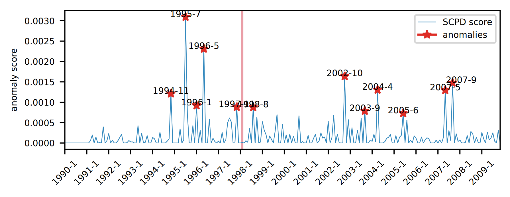

# 112-1_DataMining_SCPD
National Taiwan University of Science and Technology (NTUST)
Members: M11215021 洪子涵, , , , ,

## Experiment Enviroment
To start, we prefer creating the environment using **conda** :

```
conda create --name SCPD python=3.8
conda activate SCPD
```
Then you need to install some necessary packages. <br>
Execute the following command to install the package using **conda**:
```
conda install numpy==1.22
conda install scipy
conda install matplotlib
conda install networkx
conda install sparse
conda install scikit-learn
```
After you have performed all experiments, don't forget to close the virtual environment using :
```
deactivate
```

## Getting the dataset
Dataset Links used by the author in the SCPD paper:
* MAG History dataset : [history_scpd](https://object-arbutus.cloud.computecanada.ca/tgb/history_scpd.zip)
* COVID flight dataset: [fight_scpd](https://object-arbutus.cloud.computecanada.ca/tgb/flight_scpd.zip)
* Stablecoin dataset: [stablecoin_scpd](https://object-arbutus.cloud.computecanada.ca/tgb/stablecoin_scpd.zip)

The additional data set we applied is the flight records of the United States from Kaggle :
* Kaggle Dataset: [USA Airport Dataset](https://www.kaggle.com/datasets/flashgordon/usa-airport-dataset)
We use `datasets/airport_USAflight_dataPre.py` to and convert the dataset into `airport_USAflight.txt` in the format of `<date>, <departure airport>, <destination airport>, <number of flights>`.
The `datasets/airport_USAflight/airports_Index.txt` contains the corresponding index of each airport sorted according to ASCII.


## Running the code
We have placed the dataset in the specified folder in `/datasets`.
* Run the following instruction to compute **DOS embedding** to generate the pkl of the dataset :
```
python subroutines/dos.py
```
<br>
* Then run the following instruction to detect abnormal points in DOS embedding :
```
python subroutines/Anomaly_Detection.py
```
Finally, you will get the visual results corresponding to the dataset.
Taking the [USA Airport Dataset](https://www.kaggle.com/datasets/flashgordon/usa-airport-dataset) from Kaggle as an example, 
it will output `airport_USAflightSpectro.pdf`.
<br>
There will be a chart where you can observe anomalies in the dataset at different times.



:::warning
The *x-axis* is the different time points of the dataset, and the *y-axis* is the anomaly score.
:::


